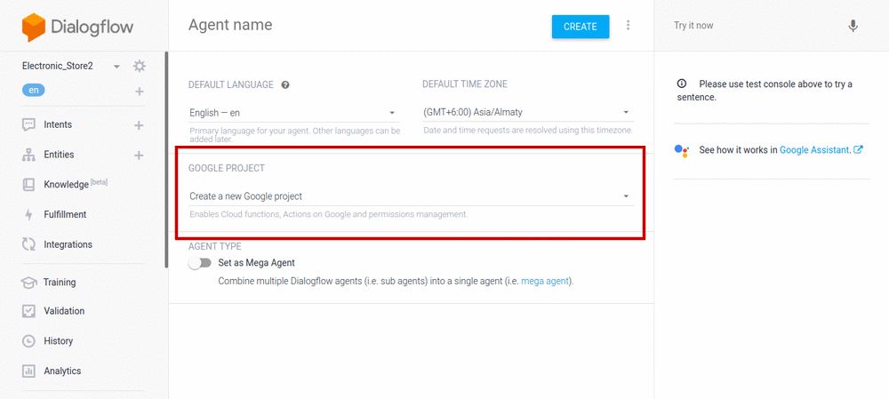
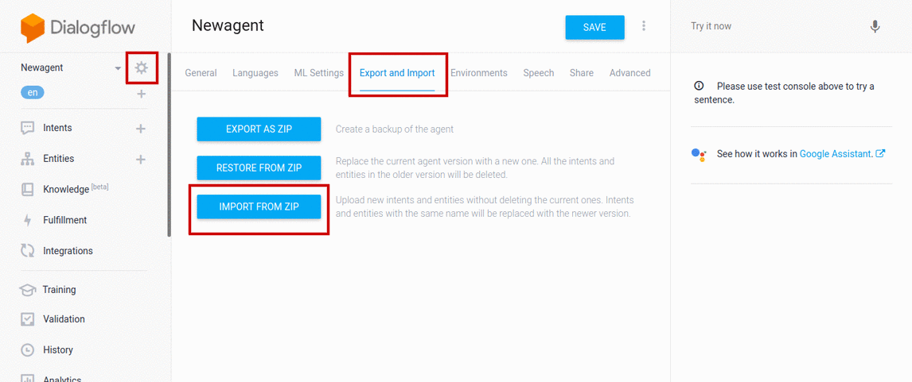

# Instructions to deploy on Dialogflow
* Create Dialogflow account.
* Goto Dialogflow console.
* Create new [agent](https://cloud.google.com/dialogflow/docs/quick/build-agent#create-an-agent). While creating agent, in the **GOOGLE PROJECT**, choose the firebase project that you created earlier while deploying Firebase Cloud Functions.
    

 
* Click on settings on top left corner.
* Select **Export and Import** tab.
* Click on **Import From ZIP**.

 
* Choose the zip file [dialogflow.zip](./dialogflow.zip)
* Type IMPORT to confirm

Now you will have to enable fulfillment in the Dialogflow console.
* Click Fulfillment in the left sidebar menu.
* Toggle the **Inline Editor** to **Enabled**.
* If you did not [enable billing](https://cloud.google.com/dialogflow/docs/quick/setup#billing) in setup steps, you are prompted to enable billing now. [See more](https://cloud.google.com/billing/docs/how-to/manage-billing-account#create_a_new_billing_account)
* Click deploy.

When the successful deploy message appears, redeploy the cloud functions as already done in the using **firebase deploy** running from ~/project_path/functions.